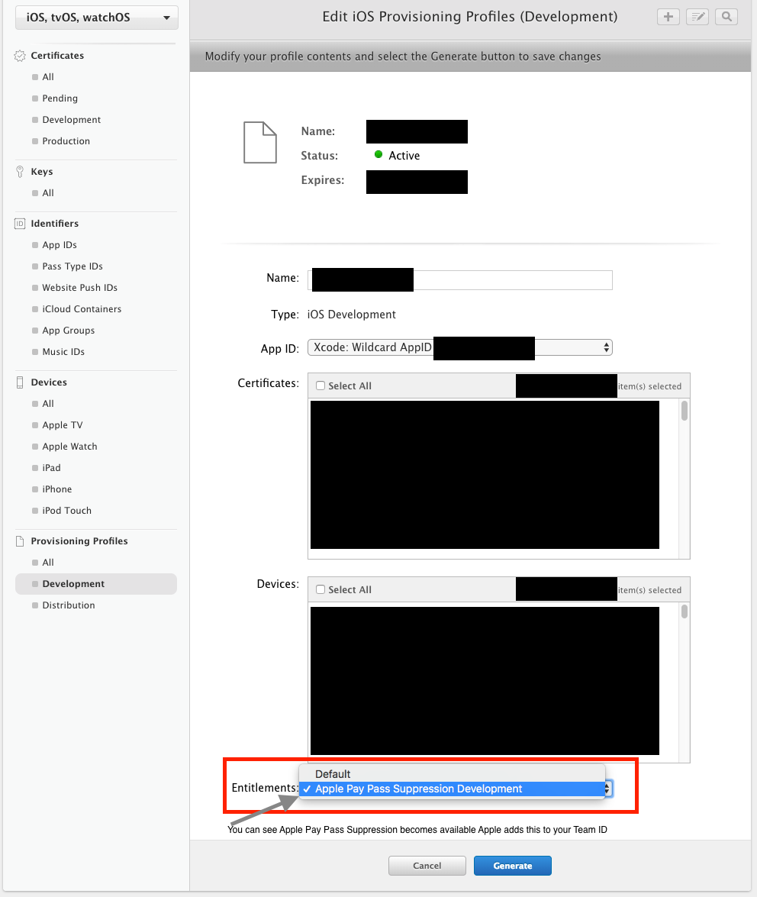
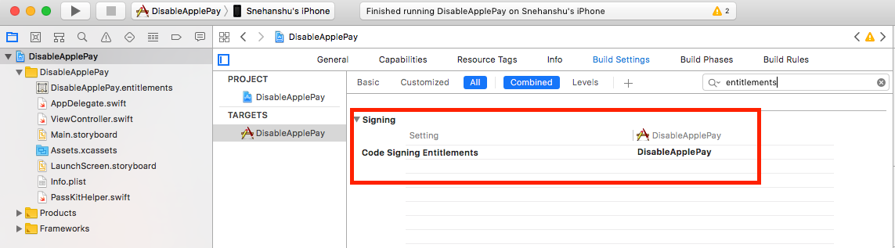
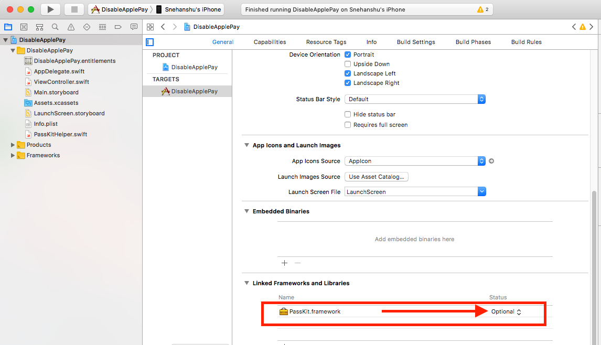

Introduction
=================

For apps that accept contactless payments, it would help if Apple Pay is disabled while accepting payments, so that the merchant's device does not get used to pay herself!
Apple does provide APIs to disable Apple Pay, and this code sample shows you how to do that, but more importantly, it includes tips for obtaining and using the necessary entitlement from Apple.

How to get started
==================

The [code for disabling Apple Pay](https://developer.apple.com/documentation/passkit/pkpasslibrary/1617078-requestautomaticpasspresentation) is relatively simple. The longer and less documented part is how to get started.
Disabling Apple Pay requires an entitlement from Apple.

Step 1- Request Entitlement for suppressing Apple Pay
=====================================================

At the time of this writing, an entitlement to disable Apple Pay can be requested by contacting apple-pay-provisioning@apple.com

I wrote to them explaining that we need to disable Apple Pay while our app is in foreground because our app accepts contactless payments using an external reader, and we do not want our merchants to accidentally pay for their customers if the merchants' phone is close to the reader during payments.

I (almost) patiently waited for about a month for Apple to respond. Finally, after a month of sending my initial email, I reached out to my friend who worked at Apple and copied him on a reminder email asking about the status. A few days later, I got a response to my reminder with the good news that our request was approved and asking me to provide our team and app details.

Step 2- Send details about your team and app
============================================

The approval is for the specific use case described in the initial email. As a next step, I was asked to provide the Team ID (found in https://developer.apple.com/account/#/membership)

Step 3- Set entilements on your profiles
========================================

A few days after sending our team IDs, I got the following reply:

> The entitlement was granted. Please head to the developer website, login, edit your provisioning profile, select the entitlement from the drop down menu.
> Then go to Xcode, head to build settings, then ensure you select a provisioning profile for which you added the entitlement on the developer website.
> Then, within Xcode, ensure you add the entitlement “com…” to the entitlement plist.

Step 4- Add entitlements
========================

After adding the entitlement as explained in the email, I needed to figure out how to add an entitlements file to my project (We do not use any other entitlement)

* A quick option to add an empty entitlements file is to go to the capabilities tab and enable some capability, then remove that capability
* Go to build settings, search for Code Signing Entitlements and set the name of the entitlements file added (removing the capability will reset the Code Signing Entitlements value). The value to be set is the entitlements file name without the .entitlements extension.
* Add row [com.apple.developer.passkit.pass-presentation-suppression](https://developer.apple.com/library/content/documentation/Miscellaneous/Reference/EntitlementKeyReference/ApplePayandPassKitEntitlements/ApplePayandPassKitEntitlements.html) to the entitlements file and set its value to Boolean, YES

Step 5- Add the Passkit framework to your project
=================================================

Remember to set it to optional if you expect your code to work with iOS < 9.0

Step 6- Download updated profiles
=================================

Ensure that you download the updated profile that has the entitlement so Xcode knows about it.

Stap 7- Use the PassKitHelper (or your custom code)
===================================================

Call requestAutomaticPassPresentationSuppression to suppress Apple Pay

